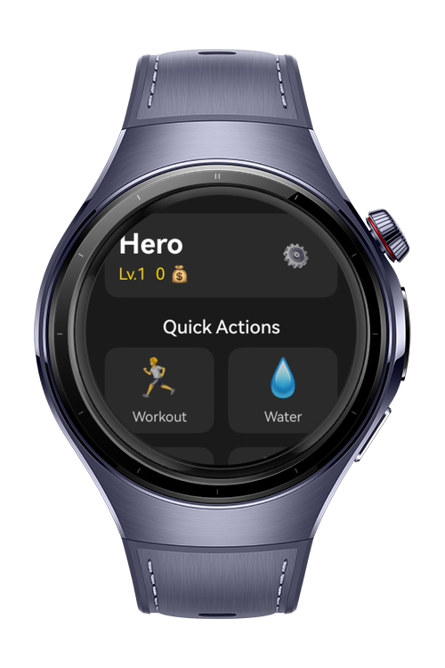
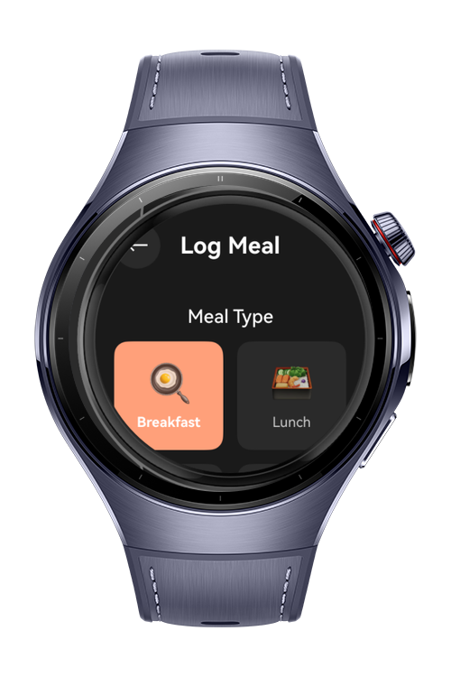
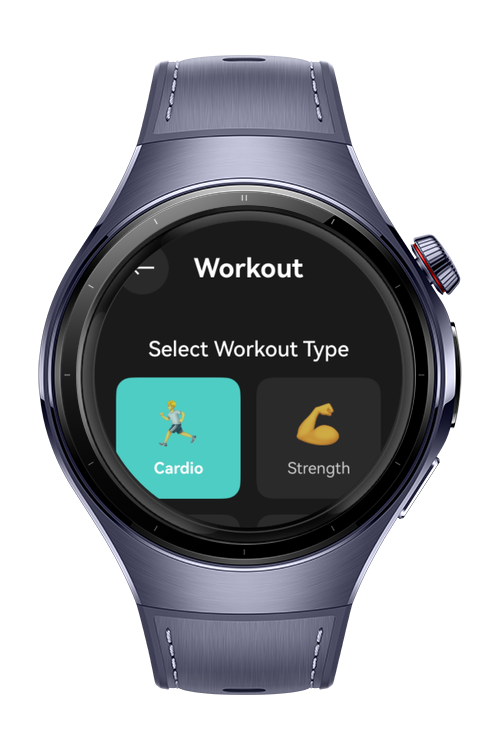
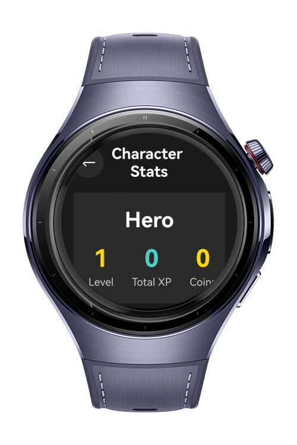

> **Note:** To access all shared projects, get information about environment setup, and view other guides, please visit [Explore-In-HMOS-Wearable Index](https://github.com/Explore-In-HMOS-Wearable/hmos-index).

# CalorieQuest

**An RPG-Style Fitness & Nutrition Tracker for HarmonyOS NEXT**

Transform your daily health activities into an epic adventure! CalorieQuest gamifies your fitness journey by turning workouts, nutrition, and hydration into RPG-style character progression.

# Preview

<p align="center">
  
  
  
  
</p>

# Use Cases
- Track workouts, steps, calories, and hydration seamlessly.
- Engage users with a gamified daily quest system and RPG progression (XP, levels, stats).
- Provide timely feedback on meal quality, presenting an easy-to-understand score.
- Motivate users to maintain streaks, unlock badges, and earn rewards.
- Build weekly habits with structured epic quests and leaderboards.

# Technology

## Stack (Languages, Frameworks, Tools, Libraries, 3rd Party)
- **Languages & Frameworks**: ArkTS (API Level 18), HarmonyOS
- **Development Tools**: DevEco Studio, npm
- **Third-Party Libraries**: Built-in Harmony UI kits and RPG design helpers (custom utilities)

## Required Permissions
Make sure required system permissions are declared for accessing sensors, notifications, and other HarmonyOS features.

## Diagrams - Process
```sequence
User->CalorieQuest App: Log workout, meal, or hydration data
App->RPG System: Update stats (XP, levels, stats)
App->User: Display feedback and rewards
```

# Tech Stack
- **ArkTS** for runtime, declarative UI, and RPG logic.
- **HarmonyOS Dev Frameworks** to integrate hardware sensors and notifications.
- **Development Tools**: DevEco Studio, Node.js/npm for build automation.

# Directory Structure

```text
CalorieQuest/
├── entry/
│   └── src/
│       └── main/
│           ├── ets/
│           │   ├── entryability/
│           │   ├── pages/          # Main watch pages
│           │   ├── components/     # Reusable UI components
│           │   ├── services/       # Business logic layer
│           │   ├── models/         # Data models
│           │   ├── utils/          # Helpers & utilities
│           │   └── constants/      # Config & constants
│           └── resources/          # Assets & localization
├── docs/                           # Documentation
└── tests/                          # Unit & integration tests
```

# Constraints and Restrictions

## Supported Devices
- **Target Device**: HarmonyOS NEXT Smartwatch
- **Form Factor**: Circular and square smartwatches (optimized layouts)

- **Battery Efficiency**
    - Animations, real-time stats, and frequent sensor usage might consume more battery than static apps.

- **Localization**
    - All in-app text is in English by default. Use the localization framework for other languages.

- **Sensor Integration**
    - Sensors like accelerometer, gyroscope, and notifications require declared permissions.

- **Data Storage**
    - RPG progress and settings must use HarmonyOS’ built-in storage APIs.

# License (MIT)

CalorieQuest is distributed under the terms of the MIT License. See the [LICENSE](./LICENSE) file for more information.